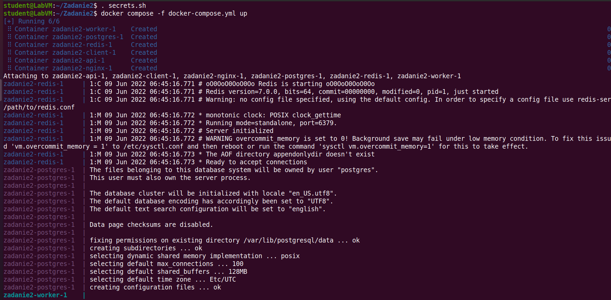
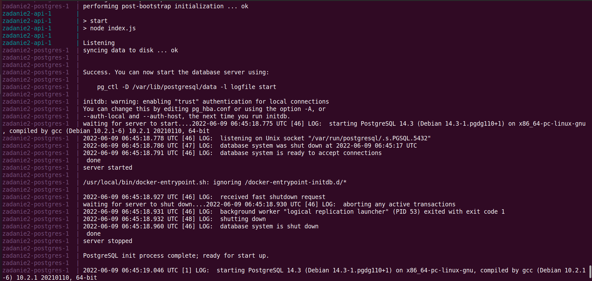
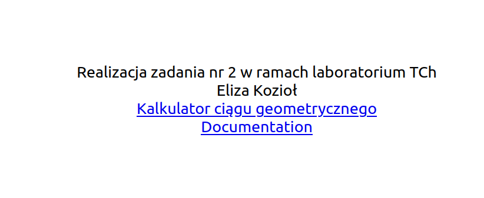
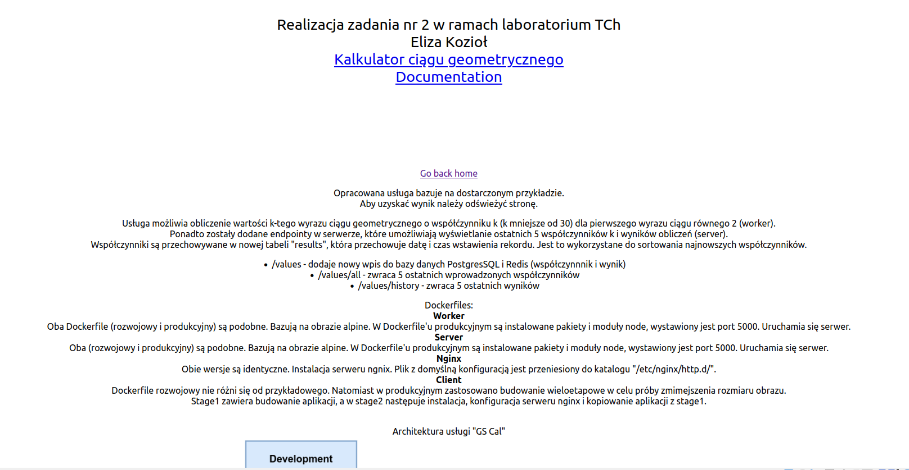

Użyte polecenia: 
  <b>
  docker build -t ek00/zad2:nazwa_obrazu* -f Dockerfile . 
  docker push ek00/zad2:nazwa_obrazu* 
  . secrets.sh 
  docker compose -f docker-compose.yml up </b>
  *nazwa_obrazu=client_prod/server_prod/nginx_prod/worker_prod
 
 Plik produlcyjny korzysta z gotowych, zbudowanych i wrzuconych na repozytorium DockerHub obrazów.
 W pliku produkcyjnym tak samo jak w rozwojowym są dwie utworzone sieci: front i back. Dodatkowo został dodany wolumen do przechowywania danych z Postgresa. Zmienne środowiskowe są również
przechowywane w folderach .config, lecz ich wartości są przechowywane w pliku secrets.sh, któy jest instalowany w Shellu. Stamtąd są pobierane i odpowiednio przypisywane do zmiennych.

    

  
  
  
  
  
  
</p
