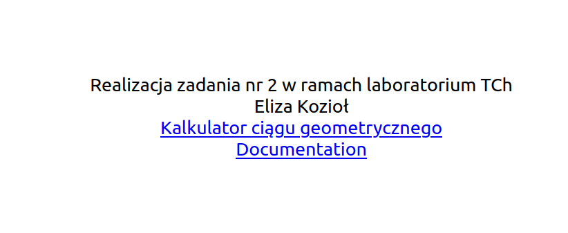
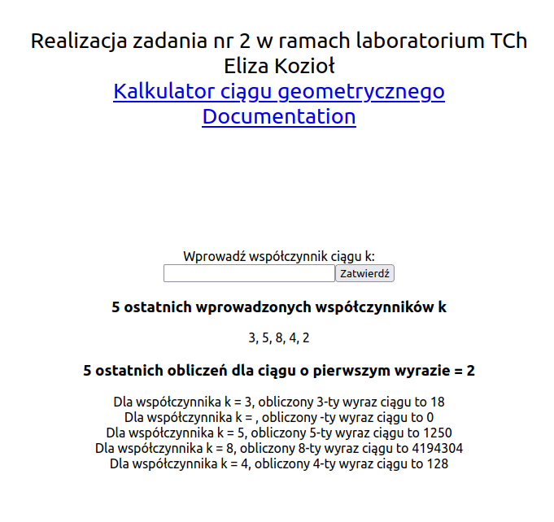

Użyte polecenia: 
  <b>docker swarm init 
  docker compose -f docker-compose.yml build 
  . secrets.sh 
  docker stack deploy -c docker-stack.yml zadanie2 </b>
W przypadku klastra Swarm, przechowywanie zmiennych środowiskowych nie jest wspierane, dlatego ponownie został użyty plik secrets.sh, a zmienne zostały na sztywno wprowadzone do pliku docker-stack.yml.

  Wszystkie kontenery korzystają z tej samej polityki restartu - restart w przypadku awarii. Postgres i Redis są węzłami managerskimi. Postgres nie wymaga wiele pamięci, ponieważ przechowuje on tylko jedną tabelę. Redis może potrzebować więcej ze względu na przechowywanie danych pamięci operacyjnej, ta może szybko rosnąć. Server(api), client wymieniają żadania czy to od strony klienta czy innych mikrousług, więc ok 75M powinno wystarczyć. Reszta kontenerów nie wymaga specjalnej ilości pamięci. Jeśli chodzi o zasoby procesora to najwięcej jest przydzielone dla servera i redisa, przetwarzają one i odpowiadają na wiele żądań. Repliki: po 2 dla clienta, api, nginxa, ponieważ odpowiadają za żądania i komunikację z użytkownikiem. Bez nich użytkownik nie będzie mógł skorzystać z aplikacji.

 
  
 
  
  
